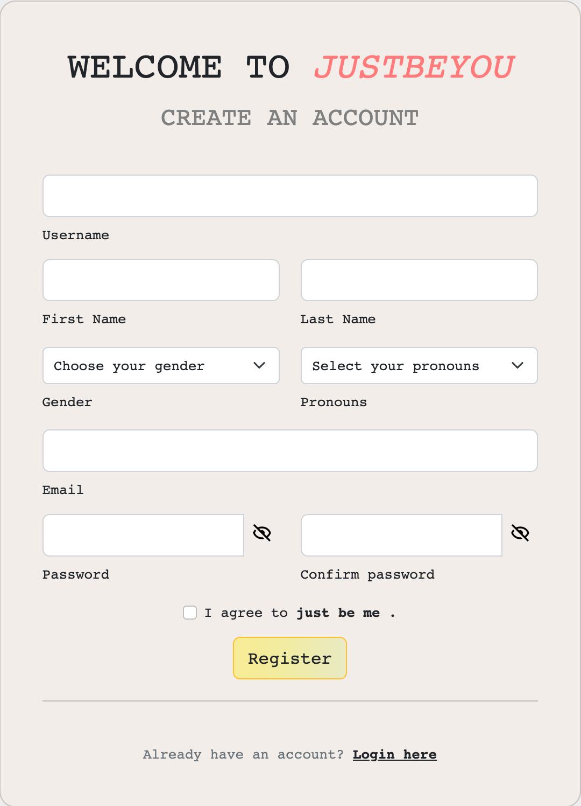
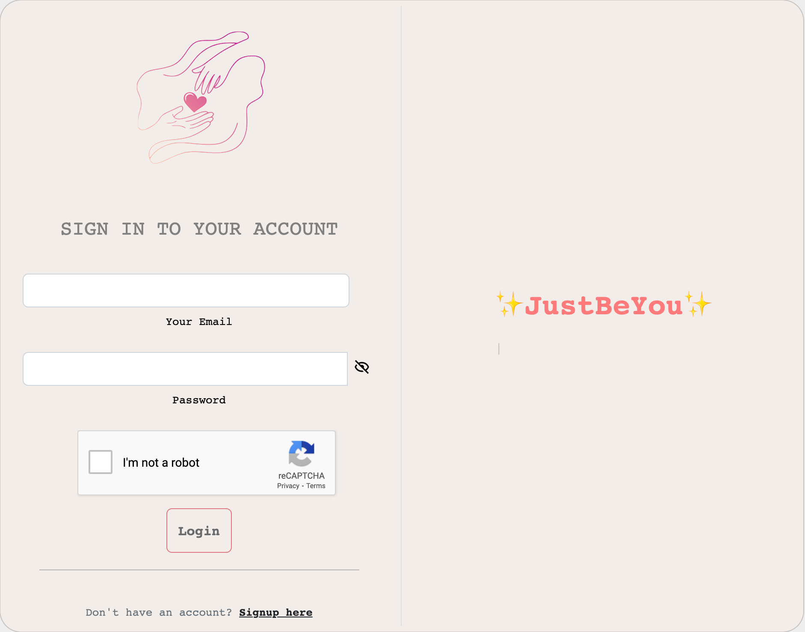
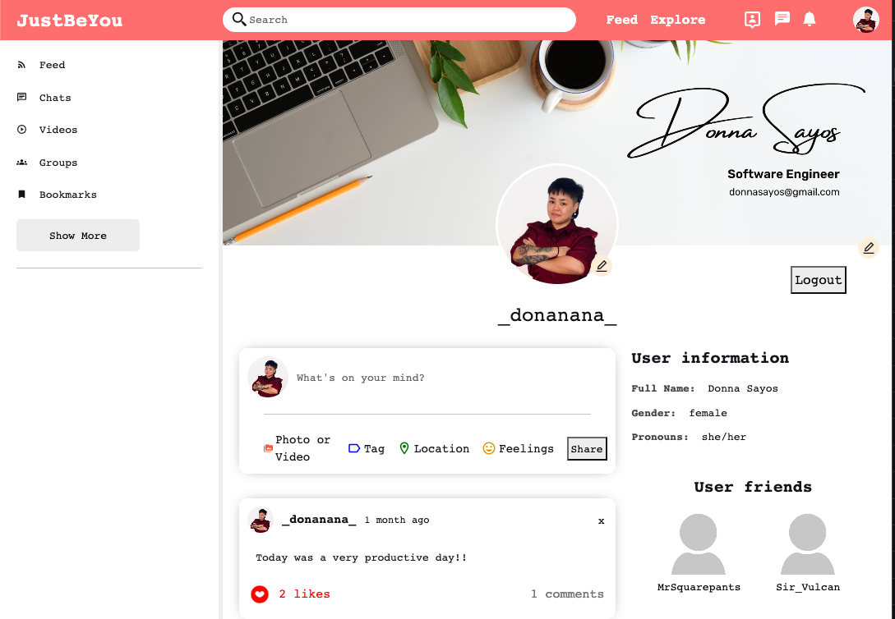
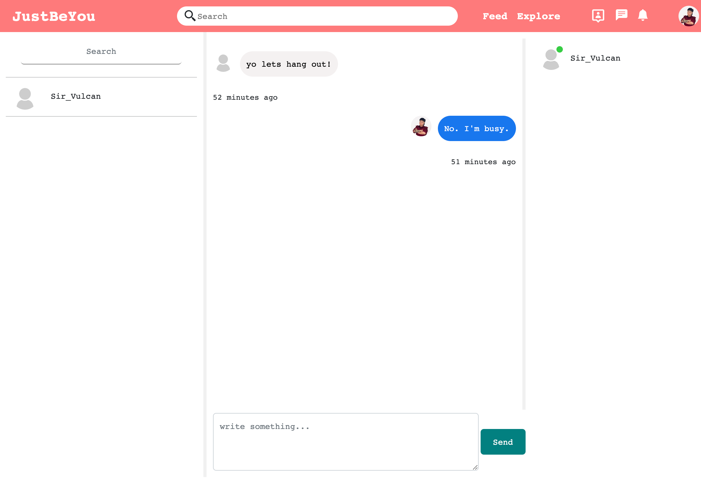
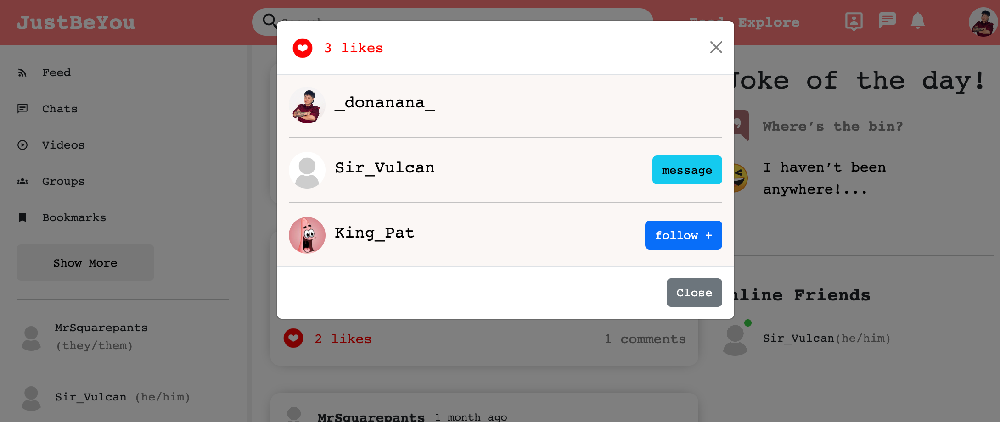
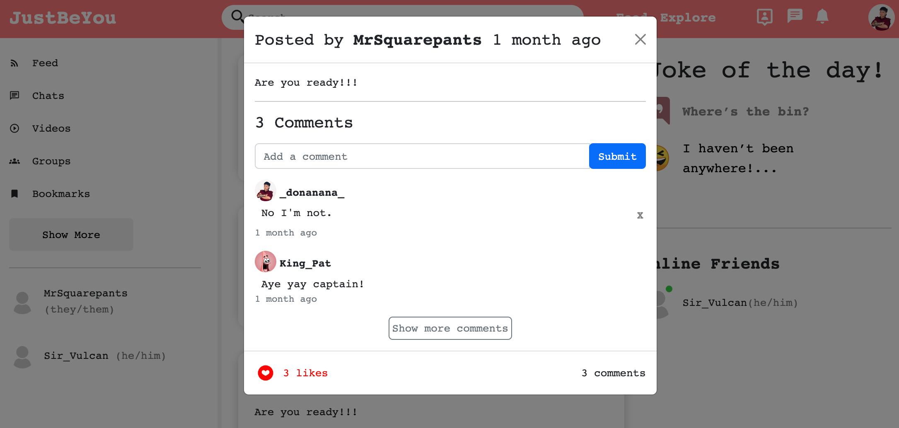

<h1 align="center">
  $${\color{lightblue} JustBeYou }$$
</h1>

  <kbd>
    
  </kbd>

Introducing <kbd>JustBeYou</kbd> - a cutting-edge social media website that brings people together in a seamless and dynamic way. Built using MongoDB, Express.js, Node.js, React.js, <kbd>JustBeYou</kbd> offers a full-stack experience that empowers users to connect, share, and engage with others like never before.

With <kbd>JustBeYou</kbd>, you can easily register and create your unique profile to showcase your personality and interests. Share your thoughts, ideas, and experiences through posts that can include not only text, but also photos, videos, gifs, and other multimedia formats. The intuitive and user-friendly interface allows for easy navigation and interaction with posts, including the ability to like and comment on content that resonates with you.

One of the standout features of <kbd>JustBeYou</kbd> is its real-time messaging capabilities powered by Socket.IO, allowing you to chat with friends and followers in real-time, creating a truly interactive and engaging experience. Additionally, <kbd>JustBeYou</kbd> seamlessly integrates Multer API for file uploads, making it convenient to share and discover multimedia content with others.

But that's not all! <kbd>JustBeYou</kbd> is a work in progress, with continuous updates and improvements being made to enhance the user experience. The website is constantly evolving, with plans to add even more exciting features before its official deployment. I'm excited to share it as it grows!

<h2 align="center">
  Features:
</h2>

  <table>
    <tr>
      <td>
        <h3 align="center">
          $${\color{lightgreen}Register}$$
        </h3>
      </td>
      <td>
        <h3 align="center">
          $${\color{lightgreen}Login}$$
        </h3>
      </td>
    </tr>
    <tr>
      <td align="center"><kbd></kbd></td>
      <td align="center"><kbd></kbd></td>
    </tr>
   </table>

  <table>
    <tr>
      <td>
        <h3 align="center">
          $${\color{lightgreen}Your \space Unique \space Profile}$$
        </h3>
      </td>
      <td>
        <h3 align="center">
          $${\color{lightgreen}Chat \space with \space friends!}$$
        </h3>
      </td>
    </tr>
    <tr>
      <td align="center"><kbd></kbd></td>
      <td align="center"><kbd></kbd></td>
    </tr>
   </table>

  <table>
    <tr>
      <td>
        <h3 align="center">
          $${\color{lightgreen}Interact \space with \space posts!}$$
        </h3>
      </td>
    </tr>
    <tr>
      <td align="center"><kbd></kbd></td>
    </tr>
   </table>

  <table>
    <tr>
      <td>
        <h3 align="center">
          $${\color{lightgreen}Leave \space a \space comment \space if \space you \space like}$$
        </h3>
      </td>
    </tr>
    <tr>
      <td align="center"><kbd></kbd></td>
    </tr>
   </table>

<h2 align="center">
  Creator:
</h2>

<h2 align="center">
  <pre>
    Donna Sayos <a href="https://www.linkedin.com/in/dsayos/"><kbd></kbd></a>
  </pre>
</h2>
