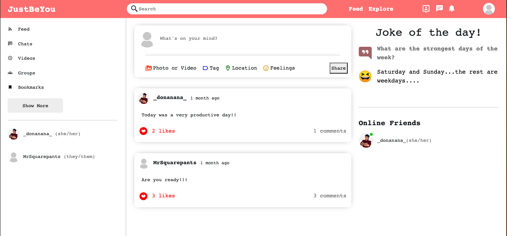

<h1 align="center">
  $${\color{lightblue} JustBeYou }$$
</h1>

  <kbd>
    
  </kbd>

  Introducing <kbd>JustBeYou</kbd> - a cutting-edge social media website that brings people together in a seamless and dynamic way. Built using MongoDB, Express.js, Node.js, React.js, <kbd>JustBeYou</kbd> offers a full-stack experience that empowers users to connect, share, and engage with others like never before.

With <kbd>JustBeYou</kbd>, you can easily register and create your unique profile to showcase your personality and interests. Share your thoughts, ideas, and experiences through posts that can include not only text, but also photos, videos, gifs, and other multimedia formats. The intuitive and user-friendly interface allows for easy navigation and interaction with posts, including the ability to like and comment on content that resonates with you.

One of the standout features of <kbd>JustBeYou</kbd> is its real-time messaging capabilities powered by Socket.IO, allowing you to chat with friends and followers in real-time, creating a truly interactive and engaging experience. Additionally, <kbd>JustBeYou</kbd> seamlessly integrates Multer API for file uploads, making it convenient to share and discover multimedia content with others.

Whether you're looking to connect with friends, share your interests, or engage with a like-minded community, <kbd>JustBeYou</kbd> is the website for you. Join the social media revolution with <kbd>JustBeYou</kbd> and experience the next generation of social networking!

<h2 align="center">
  Sole Creator:
</h2>
